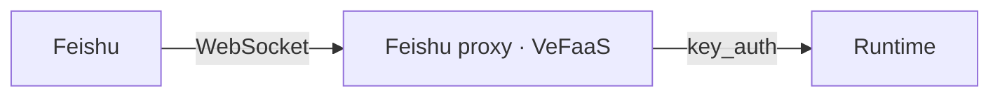

Wire an agent up as a **Feishu bot**: after deploying the runtime, `agentkit deploy` also deploys a Feishu proxy on VeFaaS that bridges Feishu and the runtime. The proxy connects out to Feishu over **WebSocket** (no public callback URL required), then calls the runtime with its `key_auth` credential.



<Note>
  First: complete [authentication](/en/agentkit-cli/commands/auth) (deploy uses AK/SK). Then create an app on the [Feishu Open Platform](https://open.feishu.cn/), enable the **bot** capability, and note the **App ID** and **App Secret** (Feishu has no API to create an app — do this once in the console).
</Note>

<Steps>
  <Step title="Create a Feishu app">
    On the Feishu Open Platform, create a **custom app**, enable the bot capability, and get the App ID and App Secret from "Credentials & Basic Info".
  </Step>
  <Step title="Scaffold a project">
    ```bash
    agentkit init my-agent -L python -t basic-agent
    cd my-agent
    ```
  </Step>
  <Step title="Declare the Feishu channel (edit agentkit.yaml)">
    Add an `im.feishu` block; credentials use `${VAR}` and stay out of the repo:

    ```yaml .agentkit/agentkit.yaml
    im:
      feishu:
        enabled: true
        app_id: ${FEISHU_APP_ID}
        app_secret: ${FEISHU_APP_SECRET}
    ```
  </Step>
  <Step title="Fill in the environment variables">
    Put the values in `.env` — the CLI loads it automatically on deploy:

    ```bash .env
    FEISHU_APP_ID=...
    FEISHU_APP_SECRET=...
    ```
  </Step>
  <Step title="Deploy">
    ```bash
    agentkit deploy
    ```

    No flags. `agentkit deploy` reads `agentkit.yaml`: it builds and deploys the runtime (`key_auth`), then deploys the Feishu proxy (WebSocket transport — no public callback URL to configure).
  </Step>
  <Step title="Chat in Feishu">
    Find your bot in Feishu and message it; the proxy forwards messages to the runtime and sends the replies back to Feishu.
  </Step>
</Steps>

Notes:

- **WebSocket transport**: the proxy dials out to Feishu, so no public callback address and no event-subscription URL are needed.
- **Credentials**: App ID and Secret use `${VAR}` and are never committed; `agentkit deploy` reuses the same proxy function idempotently — redeploys update rather than create new ones.
- **Message experience**: incoming messages get an acknowledgement reaction, and the reply streams into a live card; the model's thinking and tool calls are tucked into a separate panel that stays collapsed until you expand it.
- **Sessions & multi-tenancy**: the Feishu user maps to the runtime user and the Feishu chat maps to the runtime session, isolated per tenant — so one proxy can serve many tenants without their sessions or memory bleeding into each other.
- **Runtime auth**: on the Feishu path the runtime uses `key_auth` (the proxy holds the API key). For web login with per-user identity forwarding, see [Deploy a frontend with SSO login](/en/agentkit-cli/workflows/frontend-sso).
