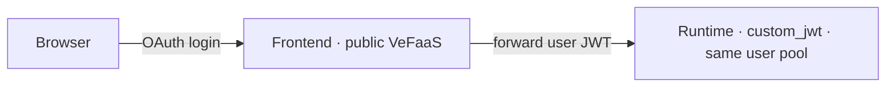

Give an agent a **public frontend workbench**: users sign in via a Volcengine user pool (which can federate Feishu or other enterprise identity), then chat with the agent in the browser. The frontend runs on VeFaaS, is publicly reachable, and handles login itself; it forwards the **signed-in user's JWT** to the runtime, which validates it with `custom_jwt` (the same user pool). There is **no shared API key** — the user's identity flows end-to-end.



<Note>
  First: complete [authentication](/en/agentkit-cli/commands/auth) (deploy uses AK/SK for the control plane); and in [Agent Identity](https://console.volcengine.com/identity) prepare a **user pool** and a **WEB client**, noting `user_pool_id` and `client_id` (the client secret is fetched automatically by the CLI). To sign in with Feishu, configure Feishu as an identity source (third-party federation) on the user pool.
</Note>

<Steps>
  <Step title="Scaffold a project">
    ```bash
    agentkit init my-agent -L python -t basic-agent
    cd my-agent
    ```
  </Step>
  <Step title="Declare the frontend (edit agentkit.yaml)">
    Add a `frontend` block. Declare the user pool here only — the runtime's `custom_jwt` gateway auth is **derived from it automatically**, so you don't repeat `auth`, and the client secret is fetched automatically, so you don't declare it. Values use `${VAR}` and stay out of the repo:

    ```yaml .agentkit/agentkit.yaml
    frontend:
      enabled: true
      oauth2:
        user_pool_id: ${USERPOOL_ID}
        client_id: ${USERPOOL_CLIENT_ID}
    envs:
      MODEL_AGENT_API_KEY: ${MODEL_AGENT_API_KEY}
    ```
  </Step>
  <Step title="Export the environment variables">
    ```bash
    export USERPOOL_ID=... USERPOOL_CLIENT_ID=...
    export MODEL_AGENT_API_KEY=...
    ```
  </Step>
  <Step title="Deploy">
    ```bash
    agentkit deploy
    ```

    `agentkit deploy` needs no flags — it reads `agentkit.yaml` and, in order, builds and deploys the runtime (`custom_jwt` derived from the user pool), then deploys the public frontend BFF on VeFaaS (reusing an existing serverless gateway, auto-fetching the client secret and auto-registering the callback `<frontend-url>/oauth2/callback`).
  </Step>
  <Step title="Open and use it">
    Open the frontend URL from the output; the browser redirects to the user pool login, and after signing in you land in the workbench and chat with the agent. The frontend shows the signed-in user's identity (name and email).
  </Step>
</Steps>

Notes:

- **No shared secret**: the client secret lives only on the frontend BFF's server side; the browser only holds a session cookie, and the BFF injects the user's JWT when calling the runtime.
- **Callback auto-registered**: `<frontend-url>/oauth2/callback` is added to the user pool client's callback list automatically (the URL is known only after deploy; the CLI fills it back in).
- **Gateway**: the frontend runs on a serverless gateway; by default an existing one is reused so it doesn't consume gateway quota. Pin a specific one with `frontend.gateway`.

When you only need a bot channel and no web login, use [Deploy as a Feishu bot](/en/agentkit-cli/workflows/feishu) instead.
