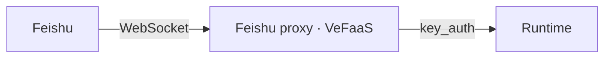

Wire an agent up as a **Feishu bot**: after deploying the runtime, `agentkit release` also deploys a Feishu proxy on VeFaaS that bridges Feishu and the runtime. The proxy connects out to Feishu over **WebSocket** (no public callback URL required), then calls the runtime with its `key_auth` credential.



<Note>
  First, follow [Authentication and login](/productions/agentkit-cli/preview/en/commands/auth) to configure AK/SK credentials or complete SSO login. Then create an app on the [Feishu Open Platform](https://open.feishu.cn/), enable the **bot** capability, and note the **App ID** and **App Secret**.
</Note>

<Warning>
Release builds an image and creates or updates the Runtime and Feishu proxy function, which may incur charges. The bot forwards user messages to the Runtime and configured model. Verify app visibility, model permissions, and permitted data before publishing
</Warning>

The examples use Volcengine Beijing. For BytePlus, set `cloud_provider: byteplus`, use a supported region at the top level and in `runtime.region`, and supply credentials and model endpoints for that platform

<Steps>
  <Step title="Create a Feishu app">
    Create a custom app on the Feishu Open Platform, enable its bot capability, and obtain the App ID and App Secret from "Credentials & Basic Info". Select long-connection event delivery, subscribe to incoming messages, and request the permissions required to receive and send messages, update cards, and add reactions. Complete permission approval and app-version publication, and include your test users in the app's availability scope

    No event callback URL is required, but the long connection and event subscriptions must still be configured
  </Step>
  <Step title="Scaffold a project">
    ```bash lines
    agentkit init my-agent --template basic --directory my-agent
    cd my-agent
    agentkit release config --name my-agent
    ```

    The `basic` template creates `my-agent.py`, while Release defaults to `main.py`. Replace `CMD` in the generated `.agentkit/Dockerfile` with the following line and retain the other build steps

    ```dockerfile
    CMD ["python", "my-agent.py"]
    ```
  </Step>
  <Step title="Declare the Feishu channel (edit .agentkit/agentkit.yaml)">
    Add an `im.feishu` block; credentials use `${VAR}` and stay out of the repo:

    ```yaml title=".agentkit/agentkit.yaml" lines
    envs:
      MODEL_AGENT_NAME: ${MODEL_AGENT_NAME}
      MODEL_AGENT_PROVIDER: openai
      MODEL_AGENT_API_BASE: ${MODEL_AGENT_API_BASE}
      MODEL_AGENT_API_KEY: ${MODEL_AGENT_API_KEY}
    im:
      feishu:
        enabled: true
        app_id: ${FEISHU_APP_ID}
        app_secret: ${FEISHU_APP_SECRET}
    ```
  </Step>
  <Step title="Fill in the environment variables">
    Put actual values in `.env`, which the CLI loads during release; add `.env` to both `.gitignore` and `.dockerignore` first. Use a model and API key available to your account. For BytePlus ModelArk, use `https://ark.ap-southeast.bytepluses.com/api/v3`:

    ```bash title=".env" lines
    FEISHU_APP_ID=your-app-id
    FEISHU_APP_SECRET=your-app-secret
    MODEL_AGENT_NAME=your-model-name
    MODEL_AGENT_API_BASE=https://ark.cn-beijing.volces.com/api/v3
    MODEL_AGENT_API_KEY=your-model-api-key
    ```
  </Step>
  <Step title="Deploy">
    ```bash lines
    agentkit release
    ```

    No flags. `agentkit release` reads `.agentkit/agentkit.yaml`: it builds and deploys the runtime (`key_auth`), then deploys the Feishu proxy (WebSocket transport — no public callback URL to configure).
  </Step>
  <Step title="Chat in Feishu">
    Check the Runtime with `agentkit runtime show my-agent`, then send a message from a test account included in the app's availability scope. A model response confirms that event delivery, the proxy, Runtime, and model are working together

    If no message arrives, check app publication, user availability, and event subscriptions. If the bot returns an error, check model settings and Runtime logs. A failed proxy deployment does not mean the Runtime was never created; inspect existing resources before retrying
  </Step>
</Steps>

Notes:

- **WebSocket transport**: the proxy dials out to Feishu, so no public callback address and no event-subscription URL are needed.
- **Credentials**: App ID and Secret use `${VAR}` and are never committed; `agentkit release` reuses the same proxy function idempotently — redeploys update rather than create new ones.
- **Message experience**: incoming messages get an acknowledgement reaction, and the reply streams into a live card; the model's thinking and tool calls are tucked into a separate panel that stays collapsed until you expand it.
- **Sessions & multi-tenancy**: the Feishu user maps to the runtime user and the Feishu chat maps to the runtime session, isolated per tenant — so one proxy can serve many tenants without their sessions or memory bleeding into each other.
- **Runtime auth**: on the Feishu path the runtime uses `key_auth` (the proxy holds the API key). For web login with per-user identity forwarding, see [Deploy a frontend with SSO login](/productions/agentkit-cli/preview/en/workflows/frontend-sso).
