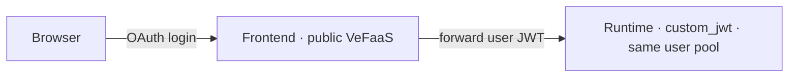

Give an agent a **public frontend**: users sign in via a Volcengine user pool (which can federate Feishu or other enterprise identity), then chat with the agent in the browser. The frontend runs on VeFaaS, is publicly reachable, and handles login itself; it forwards the **signed-in user's JWT** to the runtime, which validates it with `custom_jwt` (the same user pool). There is **no shared API key** — the user's identity flows end-to-end.



<Note>
  First, follow [Authentication and login](/productions/agentkit-cli/preview/en/commands/auth) to configure AK/SK credentials or complete SSO login. In [Agent Identity](https://console.volcengine.com/identity), prepare a **user pool** and a **WEB client**, noting `user_pool_id` and `client_id` (the client secret is fetched automatically by the CLI). To sign in with Feishu, configure Feishu as an identity source (third-party federation) on the user pool.
</Note>

## Prerequisites and version scope

Prepare a deployed target Runtime that the frontend can discover and the signed-in user is authorized to invoke. The current frontend displays cloud Runtimes by default; this flow does not automatically add the local agent from the `basic` template. For local agent-directory development, use development mode in [VeADK Frontend](/productions/veadk/preview/en/components/frontend/veadk-frontend)

The CLI 0.54.0 frontend build uses the VeADK `main` branch, so behavior depends on the version available at build time rather than a fixed VeADK release. Verify target Runtime discovery, login, and invocation permissions before production use

<Warning>
Release creates or updates a public frontend, Runtime, gateway, and user-pool callback configuration, which may incur charges and change existing access behavior. The deployment identity needs permission to manage those resources; users can invoke only Runtimes they are authorized to access
</Warning>

<Steps>
  <Step title="Scaffold a project">
    ```bash lines
    agentkit init my-agent --template basic --directory my-agent
    cd my-agent
    agentkit release config --name my-agent
    ```
  </Step>
  <Step title="Declare the frontend (edit .agentkit/agentkit.yaml)">
    Add a `frontend` block with the user pool region and project explicitly selected to avoid matching another environment. The frontend Runtime derives `custom_jwt` authentication from this pool, so do not repeat `auth`. The client secret is fetched by default; if it is not returned, reference the actual value with `frontend.oauth2.client_secret: ${USERPOOL_CLIENT_SECRET}`:

    ```yaml title=".agentkit/agentkit.yaml" lines
    frontend:
      enabled: true
      oauth2:
        region: cn-beijing
        project: default
        user_pool_id: ${USERPOOL_ID}
        client_id: ${USERPOOL_CLIENT_ID}
    ```
  </Step>
  <Step title="Fill in the environment variables">
    Put actual values in `.env`, which the CLI loads during release; exclude `.env` from version control and Docker build input with `.gitignore` and `.dockerignore`. This example uses Volcengine. For BytePlus, use its own user pool and client and update the provider, regions, and model service in release configuration:

    ```bash title=".env" lines
    USERPOOL_ID=your-user-pool-id
    USERPOOL_CLIENT_ID=your-web-client-id
    ```
  </Step>
  <Step title="Deploy">
    ```bash lines
    agentkit release
    ```
  </Step>
  <Step title="Open and use it">
    Open the frontend URL and complete user-pool login. Verify the displayed identity, confirm that the target cloud Runtime appears in the list, and then send a message. Login success only verifies authentication. If the list is empty, check Runtime discovery permissions; if a call fails, check target Runtime authentication and model settings. After signing out, accessing the page again should return to login
  </Step>
</Steps>

Notes:

- **No shared secret**: the client secret lives only on the frontend BFF's server side; the browser only holds a session cookie, and the BFF injects the user's JWT when calling the runtime.
- **Callback auto-registered**: `<frontend-url>/oauth2/callback` is added to the user pool client's callback list automatically (the URL is known only after deploy; the CLI fills it back in).
- **Gateway**: the frontend runs on a serverless gateway; by default an existing one is reused so it doesn't consume gateway quota. Pin a specific one with `frontend.gateway`.
- **Python project**: `veadk frontend` serves the UI, and the build requires a Python project with `requirements.txt`. This flow uses cloud Runtime browsing and does not load local `root_agent` directories

When you only need a bot channel and no web login, use [Deploy as a Feishu bot](/productions/agentkit-cli/preview/en/workflows/feishu) instead.
