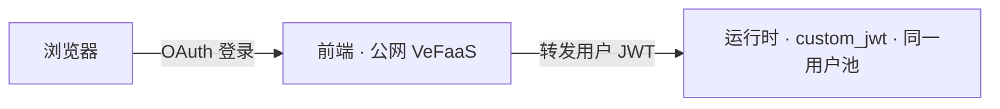

给智能体配一个**公网前端**：用户经 Volcengine 用户池 OAuth 登录（用户池可联合飞书等企业身份），登录后在浏览器里与智能体对话。前端部署在 VeFaaS 上、公网可达，自身完成登录；它把**登录用户的 JWT** 转发给运行时，运行时用 `custom_jwt`（同一个用户池）校验——**全程没有共享 API key**，用户身份端到端透传。



<Note>
  开始前：按照[鉴权与登录](/productions/agentkit-cli/preview/zh/commands/auth)配置 AK/SK 或完成 SSO 登录；并在 [Agent Identity](https://console.volcengine.com/identity) 准备一个**用户池**与一个 **WEB 客户端**，记下 `user_pool_id` 与 `client_id`（客户端 secret 由 CLI 自动获取，无需手动填）。要用飞书登录，则在用户池里把飞书配成身份来源（第三方身份联合）。
</Note>

## 部署前提与版本范围

先准备已经部署、可被前端发现且允许登录用户调用的目标 Runtime。当前前端默认展示云端 Runtime；本流程不会自动将 `basic` 模板中的本地智能体加入列表。需要本地智能体目录调试时，使用 [VeADK Frontend](/productions/veadk/preview/zh/components/frontend/veadk-frontend) 的开发模式

CLI 0.54.0 的前端构建使用 VeADK `main` 分支，实际行为随构建时的版本变化，不是固定的 VeADK 发布版本。上线前验证目标 Runtime 的发现、登录和调用权限

<Warning>
发布会创建或更新公网前端、Runtime、网关和用户池回调配置，可能产生费用并改变现有访问行为。部署身份需具备这些资源的管理权限；目标用户只能使用其获准访问的 Runtime
</Warning>

<Steps>
  <Step title="脚手架项目">
    ```bash lines
    agentkit init my-agent --template basic --directory my-agent
    cd my-agent
    agentkit release config --name my-agent
    ```
  </Step>
  <Step title="声明前端（编辑 .agentkit/agentkit.yaml）">
    加上 `frontend` 块，并显式填写用户池所在区域和项目，避免匹配到其他环境。前端 Runtime 的 `custom_jwt` 鉴权由该用户池派生，无需重复声明 `auth`。客户端密钥默认自动获取；未返回密钥时，通过 `frontend.oauth2.client_secret: ${USERPOOL_CLIENT_SECRET}` 引用实际值：

    ```yaml title=".agentkit/agentkit.yaml" lines
    frontend:
      enabled: true
      oauth2:
        region: cn-beijing
        project: default
        user_pool_id: ${USERPOOL_ID}
        client_id: ${USERPOOL_CLIENT_ID}
    ```
  </Step>
  <Step title="填写环境变量">
    将实际取值写入 `.env`，部署时 CLI 会自动加载；先将 `.env` 加入 `.gitignore` 与 `.dockerignore`。本例使用火山引擎；BytePlus 应使用独立的用户池与客户端，并同步调整发布配置的云厂商、地域和模型服务：

    ```bash title=".env" lines
    USERPOOL_ID=your-user-pool-id
    USERPOOL_CLIENT_ID=your-web-client-id
    ```
  </Step>
  <Step title="部署">
    ```bash lines
    agentkit release
    ```
  </Step>
  <Step title="打开使用">
    打开输出里的前端地址并完成用户池登录。先确认前端显示正确用户，再检查目标云端 Runtime 出现在列表中，最后发起对话。登录成功只证明身份流程可用；列表为空时检查 Runtime 发现权限，调用失败时检查目标 Runtime 鉴权和模型配置。退出后重新访问应再次进入登录流程
  </Step>
</Steps>

要点：

- **无共享密钥**：客户端 secret 只保存在前端 BFF 的服务端，浏览器只拿到会话 cookie；调用运行时时由 BFF 注入用户 JWT。
- **回调自动登记**：`<前端地址>/oauth2/callback` 会被自动加入用户池客户端的回调列表（前端地址在部署后才确定，CLI 会自动回填）。
- **网关**：前端跑在 serverless 网关上，默认复用账号里已有的 serverless 网关，避免占用网关配额；需要固定时在 `frontend.gateway` 指定。
- **Python 项目**：前端界面由 `veadk frontend` 提供，构建需要 Python 项目及 `requirements.txt`。本流程使用云端 Runtime 浏览模式，不读取本地 `root_agent` 目录

只需要机器人渠道、不需要网页登录时，改用[接入飞书机器人](/productions/agentkit-cli/preview/zh/workflows/feishu)。
