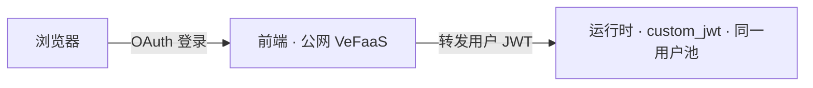

给智能体配一个**公网前端工作台**：用户经 Volcengine 用户池 OAuth 登录（用户池可联合飞书等企业身份），登录后在浏览器里与智能体对话。前端部署在 VeFaaS 上、公网可达，自身完成登录；它把**登录用户的 JWT** 转发给运行时，运行时用 `custom_jwt`（同一个用户池）校验——**全程没有共享 API key**，用户身份端到端透传。



<Note>
  开始前：完成[鉴权与登录](/zh/agentkit-cli/commands/auth)（部署走 AK/SK 控制面）；并在 [Agent Identity](https://console.volcengine.com/identity) 准备一个**用户池**与一个 **WEB 客户端**，记下 `user_pool_id`、`client_id`、`client_secret`。要用飞书登录，则在用户池里把飞书配成身份来源（第三方身份联合）。
</Note>

<Steps>
  <Step title="脚手架项目">
    ```bash
    agentkit init my-agent -L python -t basic-agent
    cd my-agent
    ```
  </Step>
  <Step title="声明前端（编辑 agentkit.yaml）">
    加上 `frontend` 块。用户池只写这一处——运行时的 `custom_jwt` 网关鉴权会**自动从它派生**，无需另写 `auth`。密钥用 `${VAR}` 从环境取，不落明文：

    ```yaml .agentkit/agentkit.yaml
    frontend:
      enabled: true
      oauth2:
        user_pool_id: ${USERPOOL_ID}
        client_id: ${USERPOOL_CLIENT_ID}
        client_secret: ${USERPOOL_CLIENT_SECRET}
    envs:
      MODEL_AGENT_API_KEY: ${MODEL_AGENT_API_KEY}
    ```
  </Step>
  <Step title="导出环境变量">
    ```bash
    export USERPOOL_ID=... USERPOOL_CLIENT_ID=... USERPOOL_CLIENT_SECRET=...
    export MODEL_AGENT_API_KEY=...
    ```
  </Step>
  <Step title="部署">
    ```bash
    agentkit deploy
    ```

    `agentkit deploy` 全程无需 flag，读 `agentkit.yaml` 依次执行：构建并部署运行时（`custom_jwt` 由用户池自动派生），再在 VeFaaS 上部署公网前端 BFF（复用已有 serverless 网关，自动获取客户端 secret、自动登记回调 `<前端地址>/oauth2/callback`）。
  </Step>
  <Step title="打开使用">
    打开输出里的前端地址，浏览器自动跳转用户池登录；登录后进入工作台，即可与智能体对话。前端展示的是登录用户的身份（名字与邮箱）。
  </Step>
</Steps>

要点：

- **无共享密钥**：客户端 secret 只保存在前端 BFF 的服务端，浏览器只拿到会话 cookie；调用运行时时由 BFF 注入用户 JWT。
- **回调自动登记**：`<前端地址>/oauth2/callback` 会被自动加入用户池客户端的回调列表（前端地址在部署后才确定，CLI 会自动回填）。
- **网关**：前端跑在 serverless 网关上，默认复用账号里已有的 serverless 网关，避免占用网关配额；需要固定时在 `frontend.gateway` 指定。

只需要机器人渠道、不需要网页登录时，改用[接入飞书机器人](/zh/agentkit-cli/workflows/feishu)。
